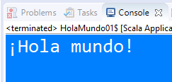

# Aprende un lenguaje de programación en un día (ejercicio voluntario para subir nota).

## Introducción

Cuando te sacas el carnet de conducir, aprendes las normas de circulación así como los fundamentos básicos para manejar un coche: volante, marchas, freno, acelerador, embrague, retrovisores... Seguramente, el coche que conduces ahora es diferente al que utilizaste para aprender a conducir, no obstante, lo puedes llevar sin problema. Cada coche tiene sus peculiaridades, pero quien sabe manejar un automóvil, puede adaptarse a las medidas, tacto y comportamiento de un vehículo en cuestión de horas.

Aprender a programar es como aprender a conducir. Si tienes una base sólida de programación y sabes manejar con soltura los tipos de datos, bucles, arrays, clases, métodos, etc. podrás pasar de un lenguaje a otro en un período relativamente corto, simplemente tendrás que adaptarte a la sintaxis y a las peculiaridades del nuevo lenguaje.

Con este ejercicio se pretende despertar el interés por otros lenguajes de programación distintos al que los alumnos estamos estudiando como primer lenguaje.

Seguimos los pasos que se indican a continuación.

## Creación del equipo

Este grupo consta de 3 alumnos. Uno de ellos es el representante del grupo.

## Forkea forkea

El representante hace un *fork* del repositorio original de [Luis José Sanchez](https://github.com/LuisJoseSanchez/aprende-un-lenguaje-en-un-dia)

## Añadiendo colaboradores

El encargado del grupo añade como colaboradores del repositorio *forkeado* a los otros dos miembros, para trabajar todos sobre los mismos archivos. Cuando alguien es colaborador en un repositorio, puede hacer *push* a él sin necesidad de pedir permiso o hacer *pull request*.

Para añadir colaboradores debemos hacer click en la pestaña *Settings* y seleccionar luego *Collaborators* en el menú.

## Miembros del grupo

El nombre del grupo es "Muñogui" y sus miembros son:

* Andrés Fernandez
* José Ángel Galera
* Rocío Matabuena

## Lenguaje de programación

El profesor llevó una cajita llena de papelitos con los nombres de distintos lenguajes de programación. El encargados de cada grupo meteió la mano en la caja y sacaró dos papelitos, de los cuales el grupo elegó uno. Se permitía hacer intercambio de papelitos entre grupos.

Uno de los dos lenguaje que nos tocó y el cual seleccionamos fue:

* Scala

Los papelitos fueron recortados de este [documento](lenguajes_de_programacion.pdf).

## Información sobre el lenguaje

Busca páginas y/o manuales sobre el lenguaje de programación elegido. Escribe aquí las principales características: etc. Pon aquí enlaces y capturas de pantalla.

Scala fue lanzando al público a principios de 2004, en la plataforma de Java. Más tarde, en Marzo de 2006, una segunda versión fue lanzada. Es un lenguaje puramente orientado a objetos en el sentido de que todo es un objeto. Los tipos y comportamientos de objetos son descritos por clases y traits. Las clases pueden ser extendidas a través de subclases y un mecanismo flexible de composición mezclada que provee un claro remplazo a la herencia múltiple.
Es usado, por ejemplo, en el desarrollo del Big Data.
Sus ventaja es que es funcional en el sentido que toda función es un valor, es estáticamente tipado (cuenta con un expresivo sistema de tipado que fuerza estáticamente las abstracciones a ser usadas en una manera coherente y segura) y es extensible, por lo que provee una única combinación de mecanismos del lenguaje que simplifican la creación de construcciones propias del lenguaje en forma de librerías.

## Herramientas de desarrollo

Instalamos el pluggin de scala para eclipse.

## Poniendo en práctica el lenguaje

Ponemos en práctica el lenguaje de programación realizando los siguientes ejercicios.

### 1. ¡Hola mundo!

```scala
/**
 * Muestra por pantalla la frase "¡Hola mundo!"
 *
 * Grupo Muñogui
 */

object HolaMundo01 {
  def main(args: Array[String]): Unit = {
  print("¡Hola mundo!")
  }
}
```



### 2. Pirámide

```scala
/**
 * Dada una altura introducida por el usuario, realiza un programa que pinte una pirámide a base de asteriscos con
 * la altura indicada.
 *
 * Grupo Muñogui
 */

import scala.io.StdIn.readInt

object piramide1 {
  def main(args: Array[String]): Unit = {
  
  print("Dime la altura de la pirámide: ")
  val n = readInt()
  println("Su altura es: " + n)
  
  var ancho = 1
  var espacio = n - 1
  var i = 0
  
  
  while (i < n) {
    println()
    var j = 0
   
    while (j < espacio) {
      print(" ")
      j = j + 1
    }
    j = 0
   while (j < ancho) {
      print("*")
      j = j + 1
    }
    espacio = espacio - 1
    ancho = ancho + 2
    i = i + 1
  }
  }
}
```


### 3. Arrays y números aleatorios

Realiza un programa que rellene un array (o una estructura similar) con 20 números enteros aleatorios entre 1 y 100 y que seguidamente los muestre por pantalla. A continuación, se deben pasar los números primos a las primeras posiciones del array y los no primos a las posiciones restantes. Muestra finalmente el array resultado.

## Presentación de resultados

Cada equipo explicará al resto de la clase lo aprendido durante la realización del ejercicio. Todos los miembros de cada equipo deben participar en la explicación y se puede utilizar como material de base para la presentación el repositorio de GitHub.

## Recompensa

* Todo alumno que realize correctamente la actividad tendrá 0'25 puntos extra en la nota del trimestre.

* Los miembros del equipo más votado ganarán un premio.

:star: Si te ha gustado este ejercicio, dale una estrellita al [repositorio original](https://github.com/LuisJoseSanchez/aprende-un-lenguaje-en-un-dia).

